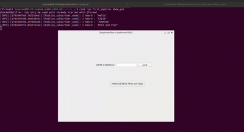
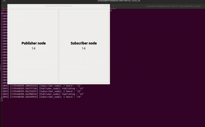

# PyQt5-and-ROS2-Jazzy-Jalisco

*Overwiew*
> This repo is a demonstration of combining Robot Operating System (ROS) and PyQt5.Using PyQt’s powerful UI components and ROS 2’s messaging and node handling capabilities, this project enables easy control and visualization of ROS-based robotic systems through  simple graphical interfaces.

# What is the importance of Graphical User Interfaces in ROS ?
The Graphical User Interface (GUI) plays an important role in ROS (Robot Operating System) for a variety of reasons, primarily centered around improving user interaction, monitoring, and control of robotic systems. While ROS itself is highly effective at handling the back-end logic of robotics systems, the addition of a GUI enhances usability and provides a more intuitive, user-friendly interface for developers, operators, and even non-technical users.

Here are several key reasons why the GUI is important in ROS:
- improved User Interaction,
- Real-Time Monitoring,
- Enhanced Visualization for Research and Development,
- User Customization.

## Dependencies used 
- ROS2 Jazzy Jalisco 
- Python 3+
- PyQt5
- Ubuntu 24.04.01
- Qt Designer 
## Create a ROS PROJECT 
In a new terminale,
```
cd ~/ros2_ws/src
source /opt/ros/jazzy/setup.bash  
ros2 pkg create --build-type ament_python --license Apache-2.0 first_pyqtros
```
## Building the project 
1. User Interface 
Open Qt designer and design an interface.Then, save the .ui file in this source file directory.Convert the .ui file to a python file. 
```
cd first_pyqtros
pyuic5 -x sketch.ui -o utils.py
```
2. Code the ROS project
Code the project with respect to the ui specifications.
3. Build the ros2 system 
don't forget,it is a ros project, so you must build it as it ought to be.
```
cd ~/ros2_ws
source /opt/ros/jazzy/setup.bash  
colcon build --packages-select first_pyqtros

```
## Running the Project 
To run the project, type the following commands in a new terminal:
```
cd ~/ros2_ws
source /opt/ros/jazzy/setup.bash  
source install/setup.bash

ros2 run first_pyqtros show_gui
```
NB: *same steps should be followed for executing the second project*

# RESULTS

## Gui of FIRST_PYQTROS



## Gui of PUBSUB_ROSPYQT


\
\
\
\
*In summary, a GUI adds immense value to ROS by making robotic systems easier to control, visualize, and debug. It serves to improve accessibility, especially for non-technical users, and enhances the development and operational experience for developers and operators. Whether for real-time control, sensor data visualization, or robot monitoring, the integration of a GUI with ROS is crucial in creating robust and user-friendly robotic applications.*